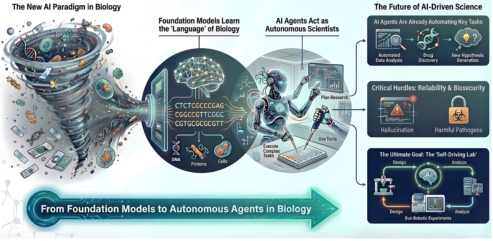

<div align="center">
  
  <h1>Awesome AI Meets Biology <a href="https://github.com/Webioinfo01/aweskill"></a></h1>
  <p><strong>AI 在生物学、生物信息学和生物医学研究中应用的精选综述。</strong></p>
  <p>论文发现、标注和筛选由 <a href="https://github.com/Webioinfo01/awescholar">awescholar</a> 驱动。技能管理通过 <a href="https://aweskill.webioinfo.top/">aweskill</a> 实现。</p>
  <p>
    <a href="./readme.md">English</a> ·
    <strong>简体中文</strong> ·
    <a href="http://awesomebio.webioinfo.top/">官网</a> ·
    <a href="https://we.webioinfo.top/">Webioinfo</a>
  </p>
  <p>
    <a href="http://awesomebio.webioinfo.top/"></a>
    <a href="https://github.com/Webioinfo01/Awesome-AI-Meets-Bioinformatics_Biomedicine"></a>
    <a href="https://github.com/Webioinfo01/Awesome-AI-Meets-Biology"></a>
  </p>
  <p>
    
    
    
    
  </p>
</div>

> 访问官方网站：http://awesomebio.webioinfo.top/

本项目由我们自主研发的 AI agent 和人类专家以人机协同（human-in-the-loop）的方式共同维护，结合自动化发现与专家审核，提供 AI 在生物学、生物信息学和生物医学研究中的全面综述。论文发现、标注和筛选由 [awescholar](https://github.com/Webioinfo01/awescholar) — 一个 AI agent 可操作的科学文献策展工具驱动。技能管理通过 [aweskill](https://aweskill.webioinfo.top/) 实现。

本仓库将 AI 在生物学/生物医学/生物信息学研究中的应用分为五大类别："AI Agents"、"Foundation models"、"Databases/Simulation"、"Benchmarks" 和 "Reviews"。

## 📋 目录
- [🌐 浏览全部内容](#浏览全部内容)
- [🔗 其他 Awesome 项目](#其他-awesome-项目)
- [贡献指南](#贡献指南)
- [引用](#引用)

## 🌐 浏览全部内容

全部 351 篇论文都在[网站](http://awesomebio.webioinfo.top/)上 — 支持按论文、团队、领域、期刊即时搜索，分类切换和年度统计：

**→ http://awesomebio.webioinfo.top/**

- 🌟 [AI Agents（智能体）](http://awesomebio.webioinfo.top/#ai-agents) — 106 篇
- 🎯 [Foundation models（基础模型）](http://awesomebio.webioinfo.top/#foundation-models) — 107 篇
- 💾 [Databases/Simulation（数据库/模拟）](http://awesomebio.webioinfo.top/#databases) — 32 篇
- 📊 [Benchmarks（基准测试）](http://awesomebio.webioinfo.top/#benchmarks) — 47 篇
- 📚 [Reviews（综述）](http://awesomebio.webioinfo.top/#reviews) — 59 篇

机器可读数据：[`docs/data.json`](docs/data.json) — 351 条完整元数据（团队、机构、期刊、代码链接）。


## 其他 Awesome 项目

- [**Awesome-AI-Virtual-Tumor**](https://github.com/Webioinfo01/Awesome-AI-Virtual-Tumor) 
- [**Awesome-LLMs-meet-genomes**](https://github.com/ychuest/Awesome-LLMs-meet-genomes) 
- [**Awesome-Virtual-Cell**](https://github.com/Boom5426/Awesome-Virtual-Cell) 
- [**Awesome-Phenotypic-Drug-Discovery**](https://github.com/Boom5426/Awesome-Phenotypic-Drug-Discovery) 
- [**Awesome-LLM-Scientific-Discovery**](https://github.com/HKUST-KnowComp/Awesome-LLM-Scientific-Discovery) 
- [**Awesome bioagent papers**](https://github.com/aristoteleo/awesome-bioagent-papers) 
- [**Awesome LLM Agents for Scientific Discovery**](https://github.com/zhoujieli/Awesome-LLM-Agents-Scientific-Discovery) 
- [**Awesome Papers on Agents for Science**](https://github.com/OSU-NLP-Group/awesome-agents4science) 
- [**awesome-single-cell**](https://github.com/seandavi/awesome-single-cell) 
- [**Awesome-Bioinformatics**](https://github.com/danielecook/Awesome-Bioinformatics) 
- [**awesome**](https://github.com/sindresorhus/awesome) 

## Supported by

本项目由以下工具驱动：

- **[awescholar](https://github.com/Webioinfo01/awescholar)** — AI agent 可自主执行的科学文献发现与策展。负责本仓库的自动论文搜索、标注和筛选。
- **[aweskill](https://github.com/Webioinfo01/aweskill)** — 一个以 CLI 为核心的 Skill 包管理器，AI agent 也能自己调用和维护。负责 skill 的安装、更新和投影，支持 47+ 编程 agent。

## Awesome 软件生态

Awesome AI Meets Biology 是一个不断壮大的 "awesome" 工具家族中的一员 — 围绕 AI 编程 agent 打造，local-first、可被 agent 直接操作。

### CLI 工具

- **[aweskill](https://aweskill.webioinfo.top/)** — CLI 优先的技能包管理器，支持 47+ AI 编程 agent。
- **[aweswitch](https://github.com/Webioinfo01/aweswitch)** — Claude Code、Codex、OpenCode 的 agent 配置切换器。
- **[awerouter](https://github.com/mugpeng/awerouter)** — 智能路由器，用结构信号把请求分给 Flash 或 Pro 模型，减少不必要的模型开销。
- **[aweshelf](https://github.com/Webioinfo01/aweshelf)** — 收藏、分类、恢复 AI 编程会话，还能搭配 aweswitch 实现保存配置，一键启动。
- **[aweshare](https://github.com/wehuman01/aweshare)** — 通过自建 Hub 共享本地 Ollama/vLLM，或国产厂商 coding plan，或已授权的 OpenAI/Anthropic 帐号订阅，实现 token 的共享经济。
- **[awewarm](https://github.com/wehuman01/awewarm)** — 订阅窗口保持器，让 AI 编程套餐的窗口持续激活，无论是本地设置，还是通过远程连接的服务器。
- **[awescholar](https://github.com/Webioinfo01/awescholar)** — AI agent 可自主执行的科学文献发现与策展，搜索、标注、筛选和报告学术论文。

### 桌面应用

- **[awedot](https://awedot.wehuman.top/)** — 悬浮球驻留屏幕边缘，实时追踪当前 AI 会话；一键收藏、随时恢复，并可搭配 aweswitch 固定 agent 配置（比如用 GLM 模型启动）。

### Project Collections

- **[Awesome AI Meets Biology](https://github.com/Webioinfo01/Awesome-AI-Meets-Biology)** — AI 在生物学、生物信息学和生物医学研究中应用的精选综述。由 awescholar 驱动。
- **[Awesome AI Virtual Tumor](https://github.com/Webioinfo01/Awesome-AI-Virtual-Tumor)** — 面向虚拟肿瘤建模与仿真的前沿 AI 系统精选合集：静态模型、动态模型、agent、基准与综述。

## 赞助与支持

如果 Awesome AI Meets Biology 帮到了你，欢迎支持一下：

- ⭐ 给项目点个 Star — 让更多人看到它。
- ☕ [Ko-fi](https://ko-fi.com/mugpeng) — 请我喝杯咖啡。
- 💬 微信 — 扫描下方收款码。

<p align="center">
  
</p>

> 你的支持让项目持续维护下去 — 谢谢。


## 贡献指南

欢迎贡献！请参阅 [CONTRIBUTING.md](docs/CONTRIBUTING.md) 了解如何添加新条目。

## 许可证

本项目采用 Mozilla Public License 2.0 许可证 - 详见 [LICENSE](LICENSE) 文件。

## 引用

如果您在研究中发现本仓库有用，请引用我们的论文：

```
Huang S, Lang M, Chen Z, Yang C, Huang X, et al. 2026. From foundation models to autonomous agents in biology. Genomics Communications 3: e006 doi: 10.48130/gcomm-0026-0005
```
